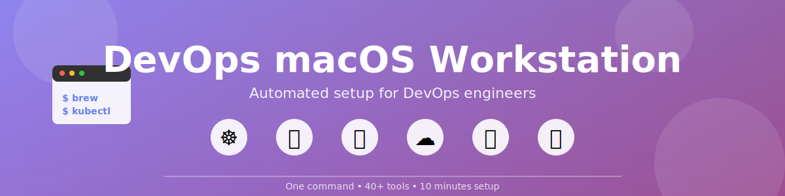

<a id="readme-top"></a>

<div align="center">
  
</div>

<br />

[![Contributors][contributors-shield]][contributors-url]
[![Forks][forks-shield]][forks-url]
[![Stargazers][stars-shield]][stars-url]
[![Issues][issues-shield]][issues-url]
[![MIT License][license-shield]][license-url]


<br />
<div align="center">
  <h3 align="center">DevOps macOS Workstation</h3>

  <p align="center">
    Automated setup for macOS development environment focused on DevOps workflows
    <br />
    <a href="#getting-started"><strong>Get Started »</strong></a>
    <br />
    <br />
    <a href="https://github.com/Kobeep/devops-macos-workstation/issues/new?labels=bug">Report Bug</a>
    ·
    <a href="https://github.com/Kobeep/devops-macos-workstation/issues/new?labels=enhancement">Request Feature</a>
  </p>
</div>

<details>
  <summary>Table of Contents</summary>
  <ol>
    <li><a href="#about">About</a></li>
    <li><a href="#features">Features</a></li>
    <li>
      <a href="#getting-started">Getting Started</a>
      <ul>
        <li><a href="#prerequisites">Prerequisites</a></li>
        <li><a href="#installation">Installation</a></li>
      </ul>
    </li>
    <li><a href="#usage">Usage</a></li>
    <li><a href="#whats-included">What's Included</a></li>
    <li><a href="#aliases">Aliases</a></li>
    <li><a href="#contributing">Contributing</a></li>
    <li><a href="#license">License</a></li>
  </ol>
</details>

## About

DevOps macOS Workstation automates the setup of essential tools and configurations for DevOps engineers working on macOS. Save hours of manual configuration with profile-based installation, dotfiles management, and pre-configured aliases.

<p align="right">(<a href="#readme-top">back to top</a>)</p>

## Features

- 📦 **Automated Package Management** - Install all tools via Homebrew
- ⚙️ **Dotfiles Management** - Symlinked configs with automatic backup
- 🔧 **Pre-configured Aliases** - kubectl, terraform, docker, git shortcuts
- 🎨 **Beautiful Terminal** - Powerlevel10k theme with oh-my-zsh
- 🚀 **Profile-based Installation** - Essential/Full/Custom options
- 🛠️ **Modular Scripts** - Separate installers for different tool categories

<p align="right">(<a href="#readme-top">back to top</a>)</p>

## Getting Started

### Prerequisites

macOS 11.0 or later

### Installation

1. Clone the repository
   ```bash
   git clone https://github.com/Kobeep/devops-macos-workstation.git ~/github/devops-macos-workstation
   ```

2. Run the installer
   ```bash
   cd ~/github/devops-macos-workstation
   ./install.sh
   ```

3. Choose your profile
   - **Essential** - Homebrew packages only
   - **Full DevOps Stack** - All tools + dotfiles
   - **Custom** - Select specific components

4. Restart your terminal

<p align="right">(<a href="#readme-top">back to top</a>)</p>

## Usage

### Quick Installation
```bash
./install.sh
```

### Manual Component Installation
```bash
# Install Homebrew packages
brew bundle

# Install specific tool categories
./scripts/kubernetes.sh
./scripts/cloud-tools.sh
./scripts/cli-tools.sh

# Link dotfiles
./scripts/symlink-dotfiles.sh
```

<p align="right">(<a href="#readme-top">back to top</a>)</p>

## What's Included

### Kubernetes Tools
- kubectl - Kubernetes CLI
- helm - Package manager
- k9s - Terminal UI
- kubectx/kubens - Context/namespace switcher
- stern - Multi-pod log tailing

### Cloud Provider CLIs
- AWS CLI
- Azure CLI
- Google Cloud SDK

### Container Tools
- Docker Desktop
- lazydocker - Terminal UI for Docker
- dive - Image layer inspector

### Infrastructure as Code
- Terraform
- Ansible

### CLI Utilities
- bat - cat with syntax highlighting
- eza - modern ls
- fzf - fuzzy finder
- ripgrep - fast grep
- fd - fast find
- jq/yq - JSON/YAML processors
- htop - process viewer
- httpie - HTTP client
- tldr - simplified man pages

### Dotfiles
- `.zshrc` - oh-my-zsh with 30+ plugins

### Configs
- Git configuration template
- k9s aliases
- iTerm2 setup guide

<p align="right">(<a href="#readme-top">back to top</a>)</p>

## Aliases

## Aliases

### Kubernetes
- `k` - kubectl
- `kgp` - get pods
- `kgs` - get services
- `kgd` - get deployments
- `kctx` - switch context
- `kns` - switch namespace

### Terraform
- `tf` - terraform
- `tfi` - init
- `tfp` - plan
- `tfa` - apply
- `tfd` - destroy

### Docker
- `dps` - ps
- `di` - images
- `dc` - docker-compose
- `dcu` - compose up
- `dcd` - compose down

### Git
- `gst` - status
- `gco` - checkout
- `gcm` - commit -m
- `gpl` - pull
- `gps` - push
- `glog` - log --oneline --graph

<p align="right">(<a href="#readme-top">back to top</a>)</p>

## Contributing

Contributions are welcome! Please feel free to submit a Pull Request.

1. Fork the Project
2. Create your Feature Branch (`git checkout -b feature/AmazingFeature`)
3. Commit your Changes (`git commit -m 'Add some AmazingFeature'`)
4. Push to the Branch (`git push origin feature/AmazingFeature`)
5. Open a Pull Request

<p align="right">(<a href="#readme-top">back to top</a>)</p>

## License

Distributed under the MIT License. See `LICENSE` for more information.

<p align="right">(<a href="#readme-top">back to top</a>)</p>

[contributors-shield]: https://img.shields.io/github/contributors/Kobeep/devops-macos-workstation.svg?style=for-the-badge
[contributors-url]: https://github.com/Kobeep/devops-macos-workstation/graphs/contributors
[forks-shield]: https://img.shields.io/github/forks/Kobeep/devops-macos-workstation.svg?style=for-the-badge
[forks-url]: https://github.com/Kobeep/devops-macos-workstation/network/members
[stars-shield]: https://img.shields.io/github/stars/Kobeep/devops-macos-workstation.svg?style=for-the-badge
[stars-url]: https://github.com/Kobeep/devops-macos-workstation/stargazers
[issues-shield]: https://img.shields.io/github/issues/Kobeep/devops-macos-workstation.svg?style=for-the-badge
[issues-url]: https://github.com/Kobeep/devops-macos-workstation/issues
[license-shield]: https://img.shields.io/github/license/Kobeep/devops-macos-workstation.svg?style=for-the-badge
[license-url]: https://github.com/Kobeep/devops-macos-workstation/blob/master/LICENSE
